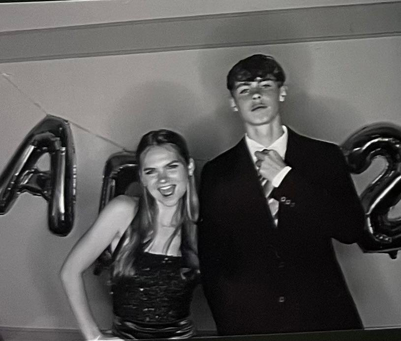
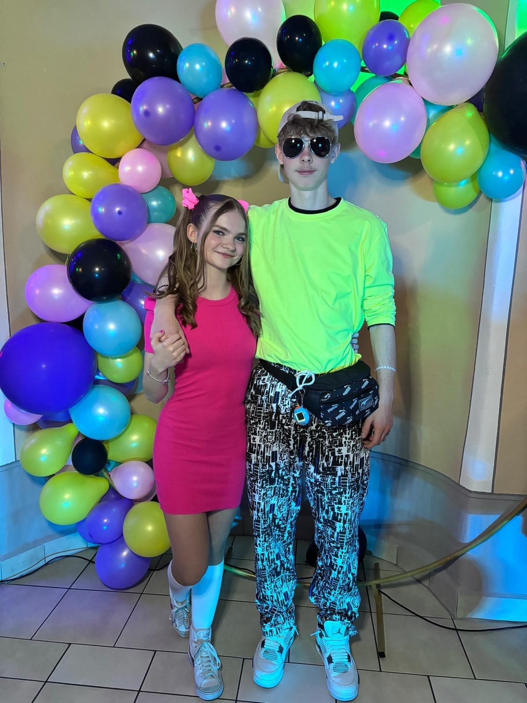
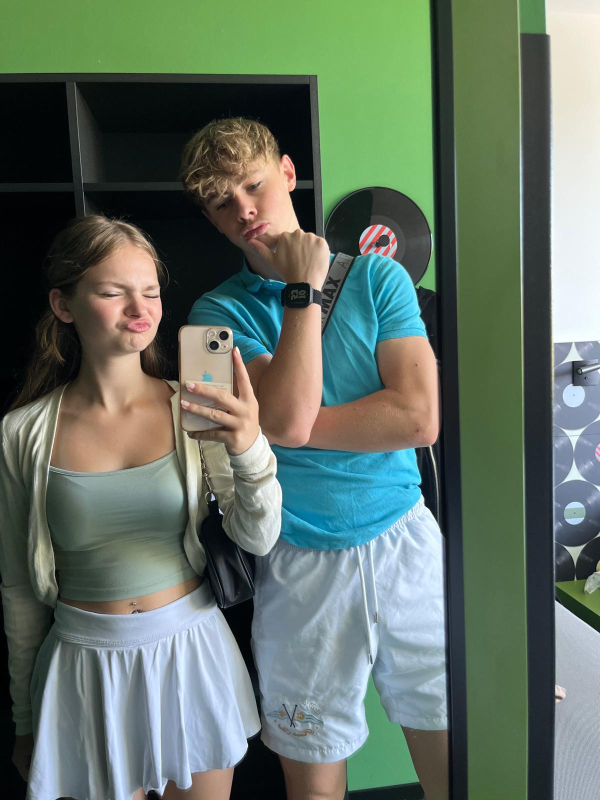
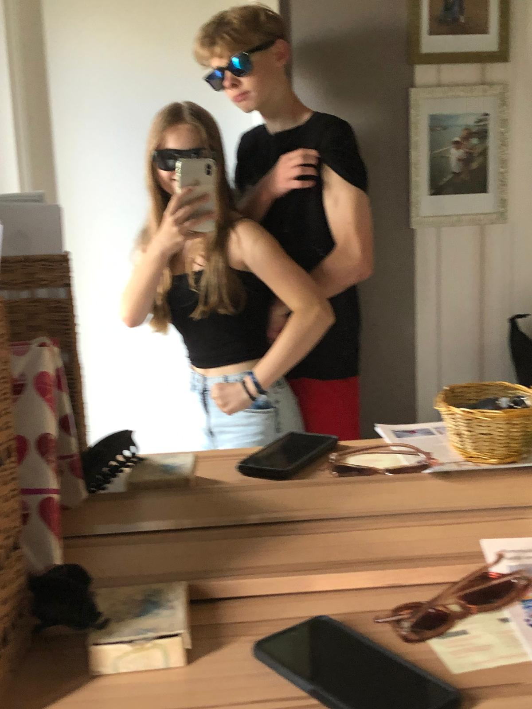

<!DOCTYPE html>
<html lang="de">
<head>
    <meta charset="UTF-8">
    <meta name="viewport" content="width=device-width, initial-scale=1.0, maximum-scale=1.0, user-scalable=no">
    <meta name="robots" content="noindex, nofollow">
    <title>Version 18.0 | Hannah</title>
    
    <link href="https://fonts.googleapis.com/css2?family=Outfit:wght@300;400;600;700&family=Fira+Code:wght@400;500&family=Permanent+Marker&display=swap" rel="stylesheet">
    
    
</head>
<body>

    

        
🔒

        <h2 style="color: var(--text-primary); margin: 0;">System gesperrt</h2>
        
Bitte Freischalt-PIN eingeben:

        <input type="text" id="pin-input" class="pin-input" placeholder="TT.MM.JJJJ">
        <button class="unlock-btn" onclick="checkPIN()">System entsperren</button>
        
Zugriff verweigert. Falsches Datum.

    

    

        
❤

        

        
Entschlüssele Erinnerungen... (0%)

    

    <audio id="bg-music">
        <source src="song.mp3" type="audio/mpeg">
        <source src="song.m4a" type="audio/mp4">
    </audio>

    

        

            <h1>Happy Birthday, Hannah</h1>
            
System-Update 18.0 erfolgreich installiert. Hier ist unser Logbuch.

        

        

            

Patch 1.0

            

Error 404

            

Update geladen

            

Seit 2022

        

        

            

Memory #1

Das Modul "Erstes Date" wurde initialisiert. Wir waren beide extrem nervös.

            

Memory #2

Orientierungssinn temporär offline. Trotzdem angekommen.

            

Memory #3

Gemeinsamer Urlaub erfolgreich in die Datenbank geladen.

            

Memory #4

Läuft erstaunlich stabil. Bestes Release bisher.

        

        

            <button class="action-btn" onclick="startGenerator()" id="gen-btn">🎁 Geschenk-Datenbank hacken</button>
            

            <button class="action-btn" onclick="startCinematicFinale()">✉️ System-Admin Nachricht</button>
        

    

    

        

        
Happy Birthday. Ich liebe dich.Dein Niklas

    

    
    

    <canvas id="confetti"></canvas>

    
</body>
</html>
